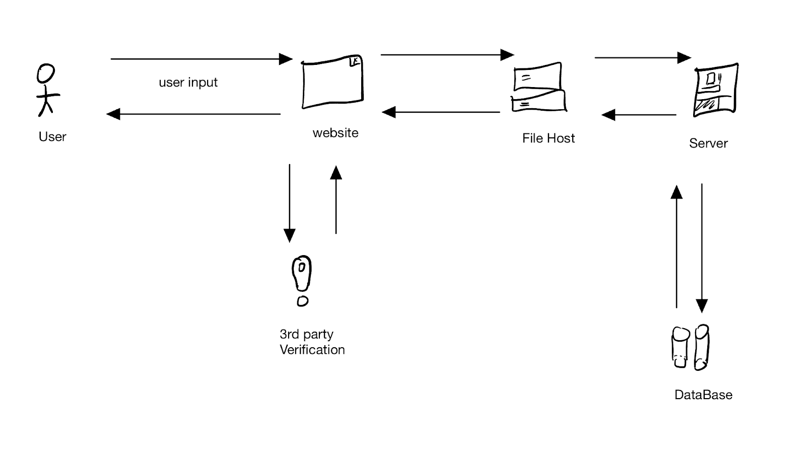

# Project 1: Online Chat Application “QuickChat”

## Product Vision

**For** individuals and organizations that need fast and secure communication across online devices, **the** “QuickChat” app is a real-time chat application **that** enables users to message between each other in real time in both public and private chat rooms, private messaging, and in creating profiles with a username and avatar. **Unlike** other traditional messaging app competitors, **our product** offers an easy to use interface, with accessibility for both personal and business use.
 

| Functional requirements (How the system must work)     Business Requirements     - The application must scale to accommodate a growing user base. Including supporting 1 million active users by the first year, and must scale to accommodate any additional users.    - A free-to-use service may be accepted for rapid customer growth, but the application must generate profits by the 5th year.    - The chat application must result in long-term profit for the business.  | Nonfunctional requirements (how the system should operate, focusing on quality attributes)    - Business Requirements A buy-out of the company (for its customer data) may be a way to monetize.    - Selling customer data directly to advertisers may also be a way to monetize.    - Banner ads and paid services (for unlimited images, or personalized user profiles) can provide scaling revenue. |
| :---- | :---- |
| User Requirements    Users can register in the app with their email, username, and password. Registered users log into the system with their ID and password.    - Users can message each other in near-real time.    - Users can join public and private chat rooms    - Users can send images and files within a group chat or private     - Users must be over the age of 13 to register for an account.conversation. | User Requirements     - User information must be stored in an encrypted and redundant database.    - Email verification or phone verification can be used to deter spam accounts. |
| System Requirements    - The system must have a website.    - The system must place a limit on file and image sizes and quantity (e.g. a max transfer of 5 megabytes per 10 minutes)  | System Requirements    - The application must be compatible with web browsers like Chrome.    - The system must deliver the messages with a latency of under 5 seconds, even during peak usage.    - The system must be user friendly, and have clear buttons for clicks and tasks. |

 
**Context Diagram** 

Contex Diagram  

